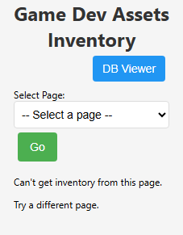
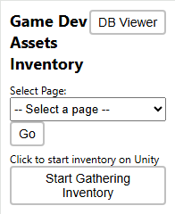
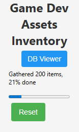
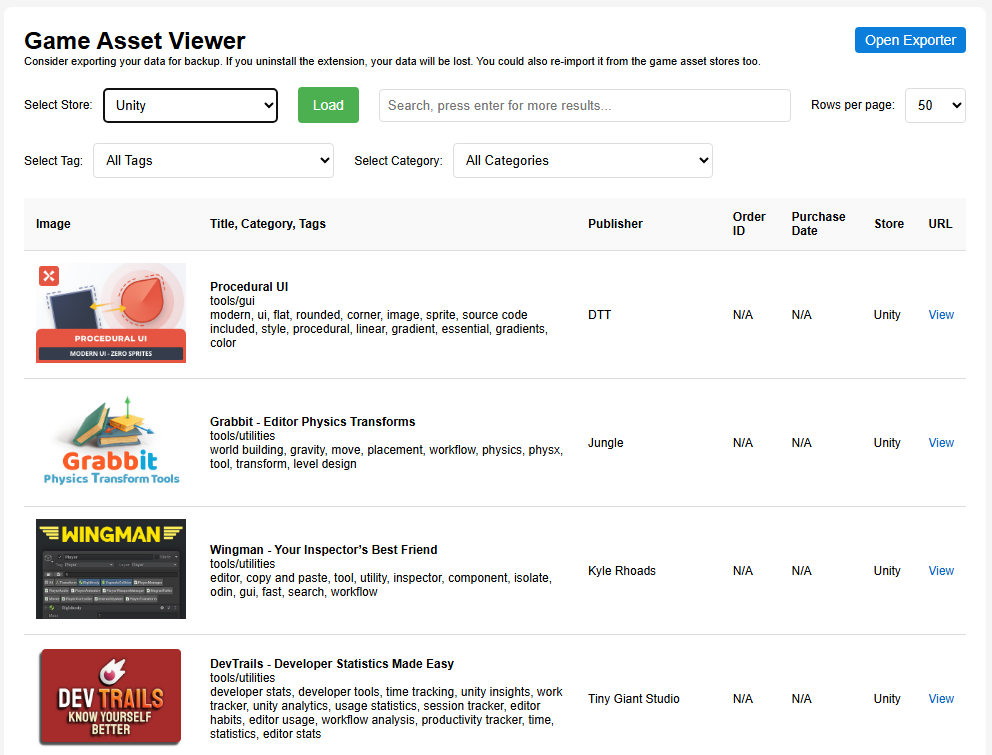
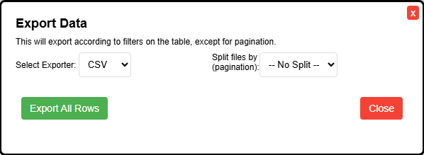

# Game Developer Asset Inventory
The purpose of this browser extension is to enable game developers to take inventory of all of the game assets that they have purchased without even downloading them. The developers can then view and filter their lists, and download the data to view in other software.

This browser extension scrapes your game development asset orders from popular sites. It stores the data in your browser's database for you to view. You have options of exporting the data to local files such as CSV and JSON. No data is collected/exported to an outside server. This is YOUR data, and this browser extension helps you view your items from all the popular stores that your ordered from. You will need to login to these sites in order for the extension to scrape the order listings.

This extension DOES NOT download the assets. It only gets basic information: **title, URL, image URL, order ID (if available), purchase date (if available), and store name**. That's it. When it does use store APIs (GraphQL), it is more narrow in scope (limited product data) than what is queried on their own websites.

I realize that people will have concerns about a browser extension that gets the data from their order history. The extension is provided here to be transparent and show what exactly the code does. It uses plain JavaScript without transpiling, minification, nor obfuscation so that it is easy to inspect and debug.

Within this repository, `src` is the code for the actual browser extension. `test_extension` is used to [test DOM and API queries](#testing).

## Note to Official Asset Store Personnel
This browser extension provides a service for the user, your users. I do not collect any information from them. Their data is stored within their browser database. The extension only gathers minimal data available on the asset store websites that will be helpful to them. See the [DB Viewer](#db-viewer) table that shows what information is collected.

Also, web requests are throttled syncronously at half a second to prevent sending too many requests at one time.

## Preferred Installation through Browser Extension Listings
The preferred way for you to install this is through the browser extension sites:
- [Firefox Addon](https://addons.mozilla.org/en-US/firefox/extensions/)
- [Chrome](https://chromewebstore.google.com/category/extensions)
- [Edge](https://microsoftedge.microsoft.com/addons/Microsoft-Edge-Extensions-Home)

The Safari browser will NOT get this extension in their App Store since it requires conversion to Swift code. However, through the Safari browser developer options, you can <a href="https://developer.apple.com/documentation/safariservices/running-your-safari-web-extension#Temporarily-install-a-web-extension-folder-in-macOS-Safari">install it manually and temporarily</a>.

#### TODO: update direct extension links when extensions are approved.

## Developer Intallation
You can install this extension temporarily and include any modifications you make to it locally. However, keep in mind it will probably disappear after you close your browser. It could be removed when your browser session ends (closed).

Clone or download this repository. Navigate to the src directory. You'll need to load extension using either the src directory or the manifest.json file within it. Check out these YouTube tutorials on how to install it:
- [Firefox install video on YouTube](https://youtu.be/dhaGRJvJAII?si=z4nBw8WIzdAorbD9&t=97)
    - Type `about:debugging#/runtime/this-firefox` into the address bar and press Enter.
    - Click the Load Temporary Add-on... button.
    - Navigate to your extension's folder and select the manifest.json file.
    - This installs the extension temporarily until Firefox restarts.
    - Notice the Inspect button, which you can click to open Developer Tools to view any console messages.
- [Chrome install video on YouTube](https://youtu.be/dhaGRJvJAII?si=IRs_BkdTNUsapC64&t=53)
    - Type `chrome://extensions/` into the address bar and press Enter.
    - Click Load Uppacked button.
    - Navigate to your extension's folder and click Select Folder button.
    - This installs the extension temporarily until Chrome restarts.
    - If you want to see background.js console messages, right click on the extension pop-up and click Inspect, and then Console.
- [Microsoft Edge install video on YouTube](https://www.youtube.com/watch?v=CeRJr2bSgR0)
    - Type `edge://extensions/` into the address bar and press Enter.
    - Click Load Uppacked button.
    - Navigate to your extension's folder and click Select Folder button.
    - This installs the extension temporarily until Edge restarts.
    - If you want to see background.js console messages, right click on the extension pop-up and click Inspect, and then Console.
- [Safari install video on YouTube](https://www.youtube.com/watch?v=J7myzTL1P4w) - an official version will NOT be released for Safari since it requires conversion to Swift code. Trying to keep this project simple.

## Supported Game Asset Stores

These are the game developer asset sites for which you can import your order/asset data from:
- [3D Shards](https://3dshards.com)
- [CGTrader](https://www.cgtrader.com)
- [Daz3D](https://www.daz3d.com)
- [Fab Unreal](https://www.fab.com)
- [Fab Quixel Megascans](https://www.fab.com/sellers/Quixel%20Megascans)
- [Gumroad](https://gumroad.com)
- [KitBash3d](https://cargo-app.kitbash3d.com)
- [Leartes Studios](https://cosmos.leartesstudios.com)
- [Ovani Sound](https://ovanisound.com)
- [RenderHub](https://www.renderhub.com)
- [Blender Superhive](https://superhivemarket.com)
- [Synty](https://syntystore.com)
- [TurboSquid](https://www.turbosquid.com)
- [Unity](https://assetstore.unity.com)

If there is another game asset store that you would like supported, [let me know with a new Github issue](https://github.com/git9875/game_developer_asset_inventory/issues).

## Using the Extension (Add-On)

In your browser toolbar, pin the extension so you'll have easy access to it. Click on the icon and you'll see a small pop-up window.

To start with, it may tell you "Can't get inventory from this page. Try a different page." Click the dropdown list and select a store. It will redirect your browser tab to the correct page that it can access the asset library. The website may redirect you to the login page. After you login, you may need to select from the dropdown again to get to the correct page.

When you are on a valid page that it can access the asset store, close and open the popup again so it will refresh. You will see a button labeled "Start Gathering Inventory". Click it it and it will start running.

It may take a little while to get running, depending on the site. The progress bar will give you an indication of how long it will take till it completes. If after a long while it does not even start, click the Reset button and refresh the web page. Close and open the extension popup, and click the "Start Gathering Inventory" button again. If it does not work, then there might be an error. You can submit an [issue through this Github page](https://github.com/git9875/game_developer_asset_inventory/issues). When this is complete, and you want to go to a different page, click the Reset button and the page selector dropdown will display again.
Note: web requests are throttled syncronously at half a second to prevent sending too many requests too quickly.

If you click somewhere else while it is still gathering, the popup may close. When you re-open it, the progress indicator may not appear yet. Give it a few seconds and it should re-appear.

**Note:** I'm limited by what I can view and research in the asset stores that I have. If I don't have enough purchased items / orders, then pagination links may not appear for me to inspect in the DevTools and find the proper HTML DOM query needed to parse additional pages. Some stores like Fab use infinite scrolling instead of pagination, and that uses additional API requests. Maybe you have more orders for such stores and this extension doesn't parse the extra pages. If so, you can [fill out an issue on this Github repository and let me know](https://github.com/git9875/game_developer_asset_inventory/issues). Any details that you can provide will be helpful. If you can go into DevTools and find the pagination links or additional API network requests, that will help me fix the issue faster (though it will require your additional help with testing). The Github issue page allows for discussions/comments that help developers and users work through problems that can't be fixed all at once.

### Website Specific Notes
In your download library on **Gumroad**, you must click on one of the items and return to the library page. Gumroad must validate that you are human in the download page. If you don't do this, then it can't scan your library and you'll get an alert message.

This extension gathers data from the **Fab Quixel Megascans** store page, whether or not you actually have access to download it. There is a download limit that prevents this extension from downloading data on all of the items in the store. This issue should be fixed soon.

## DB Viewer
To open the viewer page so you can view and filter your assets, click on the popup button labeled "DB Viewer", and it will open a new tab. You'll see a table of your game assets. Above the table is the filter form, and below the table are the pagination links. You may have to refresh this page to show newly imported items. They will be displayed in the order that they were first imported, so stuff imported later may appear in other pages.

The table includes the image preview, the title (along with category and tags if available), publisher, order ID, purchase date, the store it was imported from, and the URL (View link) to open the product details page. The extension tries to get only these details, but some stores don't make this information easily available without having to parse through many pages. So, some details (like Publisher, Order ID, Purchase Date) may not be available depending on the store.

You can quickly filter the table of items by selecting the store, tag, or category. You can further filter items by entering text in the search text box. For quick searches, entering text will filter the existing cache but it won't get other pages. If you click Enter (return) key, then it will do a more extensive search. This search can be filtered/limited to the store dropdown selection, but it won't be filtered by the tag or category selections. The tag and category filters will not be limited by the store dropdown selection, because they are independent filters. Why aren't these extra filters more integrated? It's because more filters increase the complexity and more database filtering functions. That's more code to maintain and probably it won't get much use anyway.

## Exporting Your Data
In the DB Viewer, click the "Open Exporter" button in the upper right corner. I dialog will appear. Select the file format that you would like to export it to with the "Select Exporter" dropdown, which includes CSV, Excel, JSON, and Text (tab delimited). You can split the export into multiple files by selecting the dropdown labeled "Split files by (pagination)". If there are enough items, then new buttons will appear at the bottom labeled "Export File 1", "Export File 2", and so on. By clicking the "Export All Rows" button, it will export it all into one big file.

The store name is the only filter that you can select from before opening the Exporter dialog which will limit the exported data to the selected store name.

#### Spreadsheet IMAGE function
If you have MS Excel and a MS Office 365 subscription, you can use the [IMAGE function](https://support.microsoft.com/en-us/office/image-function-7e112975-5e52-4f2a-b9da-1d913d51f5d5) and with it you can then view your image previews within Excel. **CAUTION**: If you have many rows, then this function may open many images and that will increase the amount of memory required by MS Excel, potentially causing it to freeze. This doesn't happen in the browser viewing page because the images have lazy loading and pagination.

[Google Sheets also has an IMAGE function](https://support.google.com/docs/answer/3093333?sjid=10609043950136059980-NC). Again, take caution with the amount of rows and images that will be loaded.

To mitigate the issue of too many images in the spreadsheet, you could export filter the exported data by store name first, which will reduce the amount of rows exported.

## Testing
... the queries on HTML DOMs and APIs

Websites change over time. This browser extension depends on quering the HTML DOM structures and APIs. When they change, the extension can break. Therefore, an additional browser extension, `test_extension`, is included in this repository to test the queries that are used and provide immediate validation without breaking. You can install it using the browser extension developer features if you want. I use it periodically every mid-month to ensure the queries still work, and then fix the ones that are broken.

*Note to self: DO NOT release too much public code that requires periodic updates! That will consume too much of my time or allow bugs to accumulate due to external dependencies. Is anyone else out there interested in becoming a project partner that can take on this responsibility?*

To install the test extension, see [Developer Installation](#developer-intallation), but select test_extension rather than src for the directory.

#### TODO: most tests have not been implemented yet.
Completed tests so far:
- [x] 3D Shards
- [ ] CGTrader
- [ ] Daz3D
- [ ] Fab Quixel
- [ ] Fab Unreal
- [ ] Gumroad
- [ ] Kitbash3D
- [ ] Leartes Studios
- [ ] Ovani Sound
- [ ] RenderHub
- [ ] Blender (Super Hive)
- [ ] Synty Studios
- [ ] TurboSquid
- [ ] Unity Asset Store

In the Test Viewer page, the records are in reverse order to show the latest tests first. The Group Timestamp column represents a test run on a group of tests on a page (game asset store). The dark gray row is a visual separator of test runs.

----

## Contributing
I am open to suggestions and feedback. If you encounter any issues or have suggestions for improvements, please open an issue or submit a pull request. Also, [let me know](https://github.com/git9875/game_developer_asset_inventory/issues) if there is an asset store that should be included.

## License
This project is licensed under the [Mozilla Public License](https://www.mozilla.org/en-US/MPL/2.0/).  
You are free to use, modify, and distribute with minimal restriction.

## Acknowledgements
Thanks to the open-source community for their contributions and support.
- [ExcelJS - to export to MS Excel spreadsheet](https://github.com/exceljs/exceljs)

Code research aided by Google Gemini. Code completion and suggestions provided by Github Copilot in VS Code. Thanks to the contributors on StackOverflow and Reddit too!

## Links
- [Official Page on Vintillect website](https://vintillect.com/game_developer_asset_inventory/)
- [Privacy Policy](https://vintillect.com/game_developer_asset_inventory/privacy.html)
